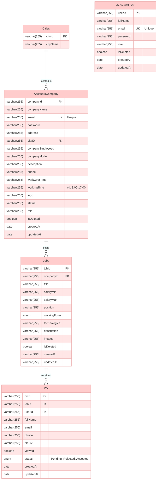

```mermaid
%%{init: {'theme':'base', 'themeVariables': { 'primaryColor':'#ffcccc'}, 'er': {'layoutDirection': 'LR'}}}%%
erDiagram
    Cities ||--o{ AccountsCompany : "located in"
    AccountsCompany ||--o{ Jobs : "posts"
    Jobs ||--o{ CV : "receives"

    AccountsCompany {
        varchar(255) companyId PK
        varchar(255) companyName
        varchar(255) email UK "Unique"
        varchar(255) password
        varchar(255) address
        varchar(255) cityID FK
        varchar(255) companyEmployees
        varchar(255) companyModel
        varchar(255) description
        varchar(255) phone
        varchar(255) workOverTime
        varchar(255) workingTime "vd: 8:00-17:00"
        varchar(255) logo
        varchar(255) status
        varchar(255) role
        boolean isDeleted
        date createdAt
        date updatedAt
    }

    AccountsUser {
        varchar(255) userId PK
        varchar(255) fullName
        varchar(255) email UK "Unique"
        varchar(255) password
        varchar(255) role
        boolean isDeleted
        date createdAt
        date updatedAt
    }

    Cities {
        varchar(255) cityId PK
        varchar(255) cityName
    }

    Jobs {
        varchar(255) jobId PK
        varchar(255) companyId FK
        varchar(255) title
        varchar(255) salaryMin
        varchar(255) salaryMax
        varchar(255) position
        enum workingForm
        varchar(255) technologies
        varchar(255) description
        varchar(255) images
        boolean isDeleted
        varchar(255) createdAt
        varchar(255) updatedAt
    }

    CV {
        varchar(255) cvId PK
        varchar(255) jobId FK
        varchar(255) userId FK
        varchar(255) fullName
        varchar(255) email
        varchar(255) phone
        varchar(255) fileCV
        boolean viewed
        enum status "Pending, Rejected, Accepted"
        date createdAt
        date updatedAt
    }

```
