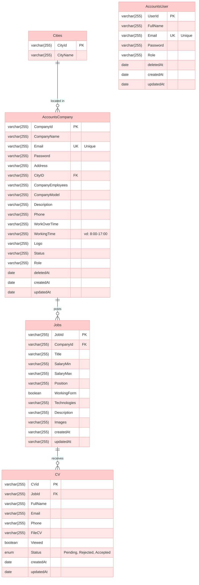

```mermaid
%%{init: {'theme':'base', 'themeVariables': { 'primaryColor':'#ffcccc'}, 'er': {'layoutDirection': 'LR'}}}%%
erDiagram
    Cities ||--o{ AccountsCompany : "located in"
    AccountsCompany ||--o{ Jobs : "posts"
    Jobs ||--o{ CV : "receives"

    AccountsCompany {
        varchar(255) CompanyId PK
        varchar(255) CompanyName
        varchar(255) Email UK "Unique"
        varchar(255) Password
        varchar(255) Address
        varchar(255) CityID FK
        varchar(255) CompanyEmployees
        varchar(255) CompanyModel
        varchar(255) Description
        varchar(255) Phone
        varchar(255) WorkOverTime
        varchar(255) WorkingTime "vd: 8:00-17:00"
        varchar(255) Logo
        varchar(255) Status
        varchar(255) Role
        date deletedAt
        date createdAt
        date updatedAt
    }

    AccountsUser {
        varchar(255) UserId PK
        varchar(255) FullName
        varchar(255) Email UK "Unique"
        varchar(255) Password
        varchar(255) Role
        date deletedAt
        date createdAt
        date updatedAt
    }

    Cities {
        varchar(255) CityId PK
        varchar(255) CityName
    }

    Jobs {
        varchar(255) JobId PK
        varchar(255) CompanyId FK
        varchar(255) Title
        varchar(255) SalaryMin
        varchar(255) SalaryMax
        varchar(255) Position
        boolean WorkingForm
        varchar(255) Technologies
        varchar(255) Description
        varchar(255) Images
        varchar(255) createdAt
        varchar(255) updatedAt
    }

    CV {
        varchar(255) CVid PK
        varchar(255) JobId FK
        varchar(255) FullName
        varchar(255) Email
        varchar(255) Phone
        varchar(255) FileCV
        boolean Viewed
        enum Status "Pending, Rejected, Accepted"
        date createdAt
        date updatedAt
    }

```
