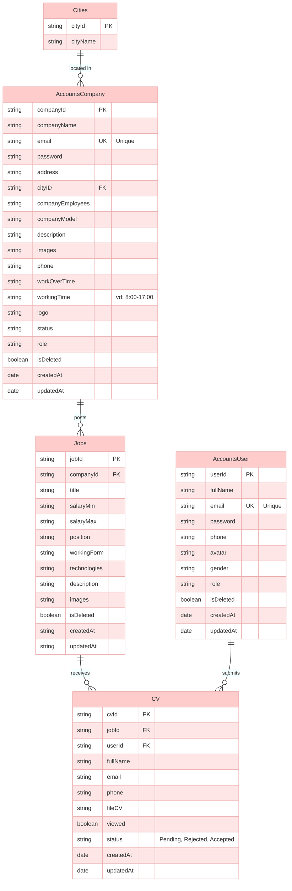

```mermaid
%%{init: {'theme':'base', 'themeVariables': { 'primaryColor':'#ffcccc'}, 'er': {'layoutDirection': 'LR'}}}%%
erDiagram
    Cities ||--o{ AccountsCompany : "located in"
    AccountsCompany ||--o{ Jobs : "posts"
    Jobs ||--o{ CV : "receives"
AccountsUser ||--o{ CV : "submits"
    AccountsCompany {
       string companyId PK
       string companyName
       string email UK "Unique"
       string password
       string address
       string cityID FK
       string companyEmployees
       string companyModel
       string description
       string images
       string phone
       string workOverTime
       string workingTime "vd: 8:00-17:00"
       string logo
       string status
       string role
        boolean isDeleted
        date createdAt
        date updatedAt
    }

    AccountsUser {
       string userId PK
       string fullName
       string email UK "Unique"
       string password
       string phone
       string avatar
       string gender
       string role
        boolean isDeleted
        date createdAt
        date updatedAt
    }

    Cities {
       string cityId PK
       string cityName
    }

    Jobs {
       string jobId PK
       string companyId FK
       string title
       string salaryMin
       string salaryMax
       string position
       string workingForm
       string technologies
       string description
       string images
      boolean isDeleted
       string createdAt
       string updatedAt
    }

    CV {
       string cvId PK
       string jobId FK
       string userId FK
       string fullName
       string email
       string phone
       string fileCV
      boolean viewed
       string status "Pending, Rejected, Accepted"
         date createdAt
         date updatedAt
    }

```
